# 🔗 Secure Product Chain

A Blockchain-Based Fake Product Detection System that enables manufacturers to register products on the Ethereum blockchain and allows customers to verify product authenticity using QR codes.

---

## 📖 Project Overview

Counterfeit products are a major issue across industries. This project uses Blockchain technology to create an immutable product registry where manufacturers can securely register products and customers can verify authenticity by scanning a QR code.

---

## ✨ Features

- 👤 User Registration & Login
- 🔐 JWT Authentication
- 👨‍💼 Role-Based Access (Admin, Manufacturer, Customer)
- ⛓ Ethereum Smart Contract
- 🦊 MetaMask Wallet Integration
- 📦 Product Registration
- 📱 QR Code Generation
- ✅ Product Verification
- 🗄 MongoDB Database
- 🌐 REST API using Express.js

---

## 🛠 Tech Stack

### Frontend
- HTML5
- CSS3
- JavaScript
- Ethers.js

### Backend
- Node.js
- Express.js
- MongoDB
- Mongoose
- JWT Authentication

### Blockchain
- Solidity
- Hardhat
- MetaMask
- Ethereum Local Network

---

## 📂 Project Structure

```
SecureProductChain/
│
├── backend/
├── frontend/
├── contracts/
├── ignition/
├── screenshots/
├── test/
├── package.json
├── hardhat.config.js
└── README.md
```

---

## 🚀 Installation

### Clone Repository

```bash
git clone https://github.com/Bency-Hanita-Angelica-K/Secure-Product-Chain.git
```

### Install Dependencies

```bash
npm install
```

```bash
cd backend
npm install
```

### Start Hardhat Node

```bash
npx hardhat node
```

### Deploy Smart Contract

```bash
npx hardhat ignition deploy ./ignition/modules/ProductVerification.js --network localhost
```

### Start Backend

```bash
cd backend
npm start
```

### Start Frontend

Open the `frontend` folder using VS Code Live Server.

---

## 📸 Project Screenshots

### 🏠 Homepage


---

## 👨‍🏭 Manufacturer Module

### Manufacturer Login

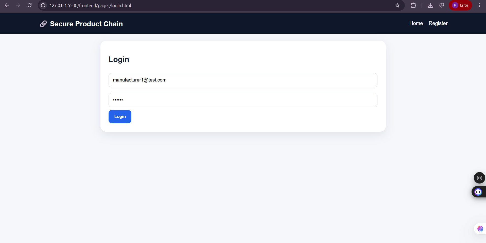

### Dashboard

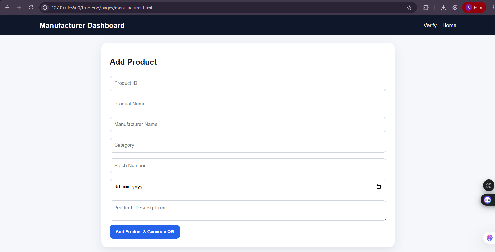

### Add Product

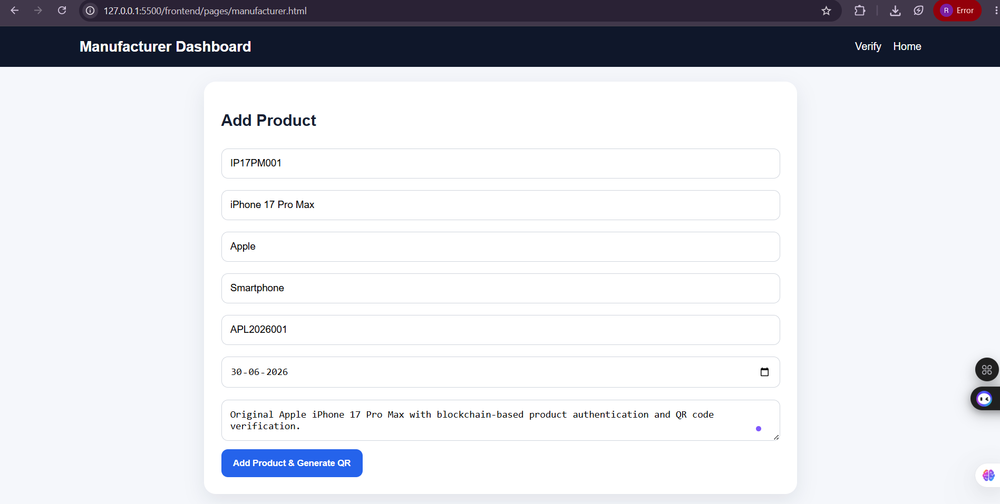

### MetaMask Transaction

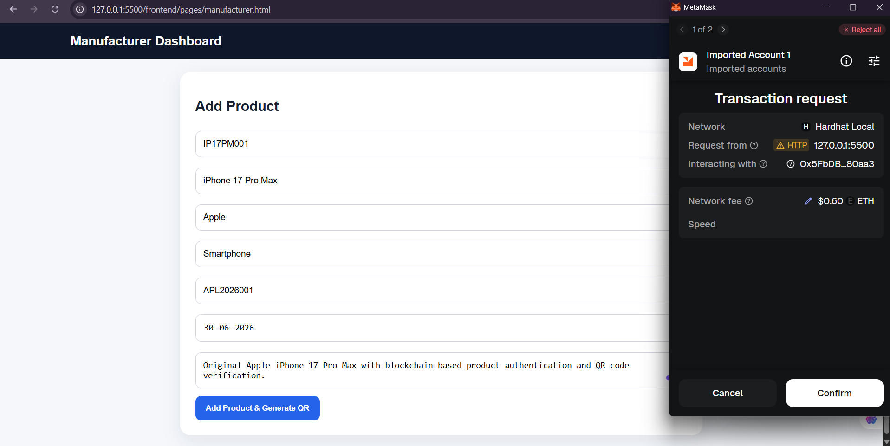

### Product Registration & QR Code Generation

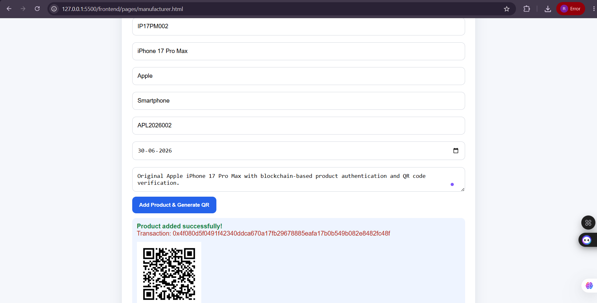

---

## 👤 Customer Module

### Customer Login

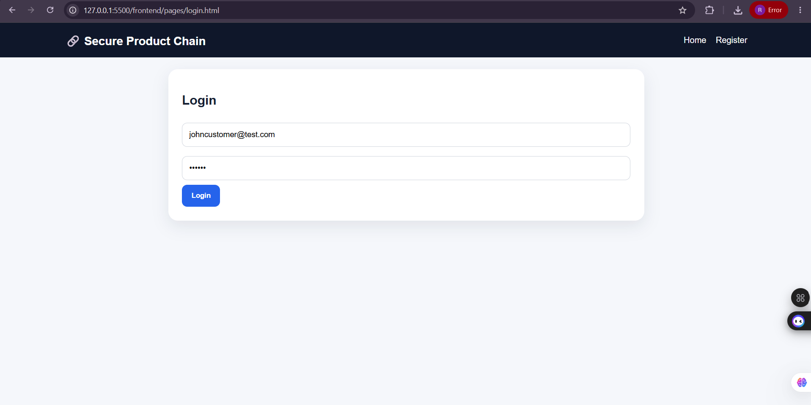

### Scan QR Code

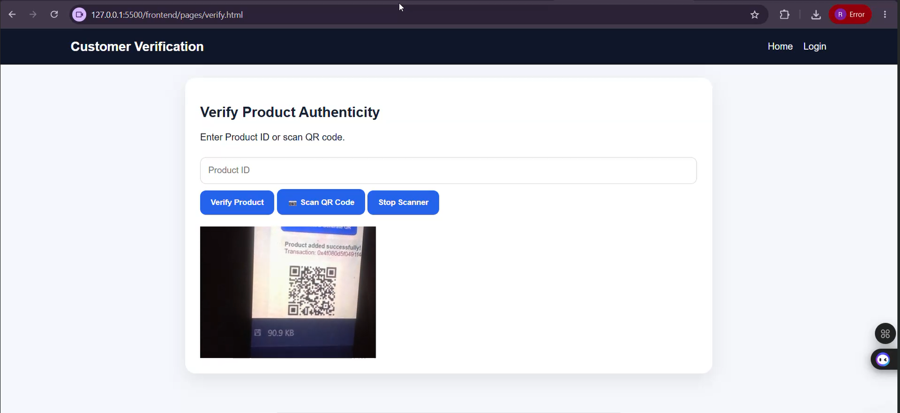

### Verify Product

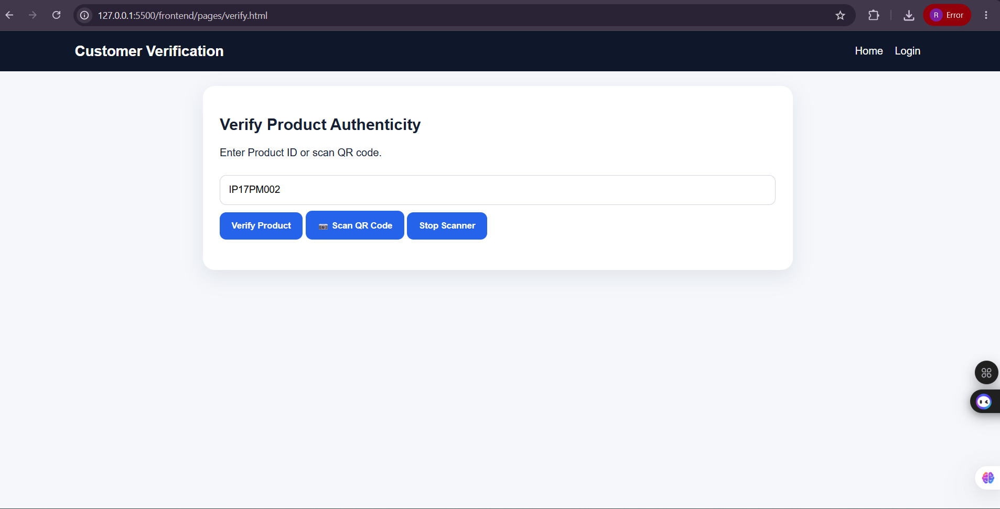

### Genuine Product Result

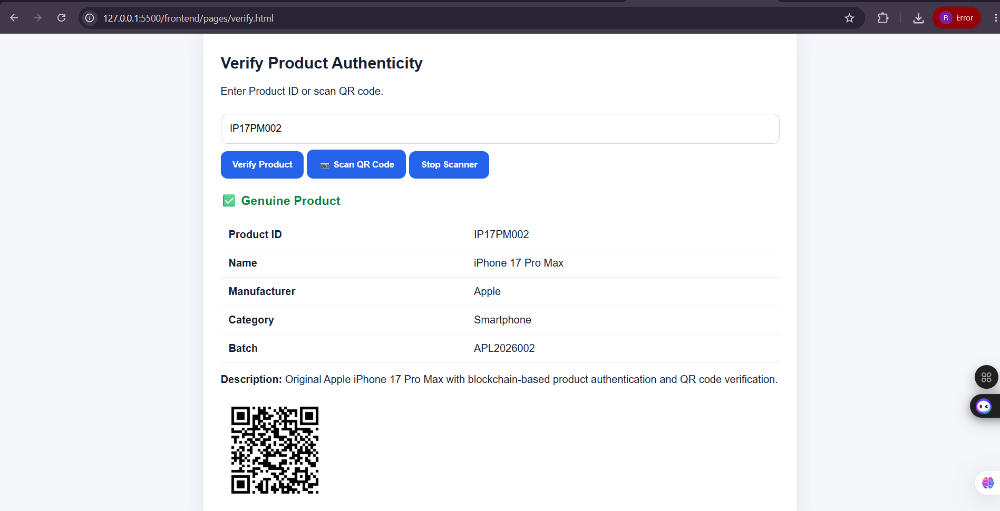

### Invalid Product Result

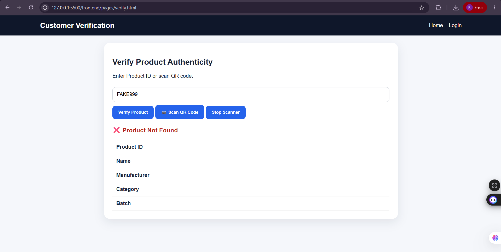

---

## 👨‍💼 Admin Module

# 👨‍💼 Admin Module

### Admin Registration

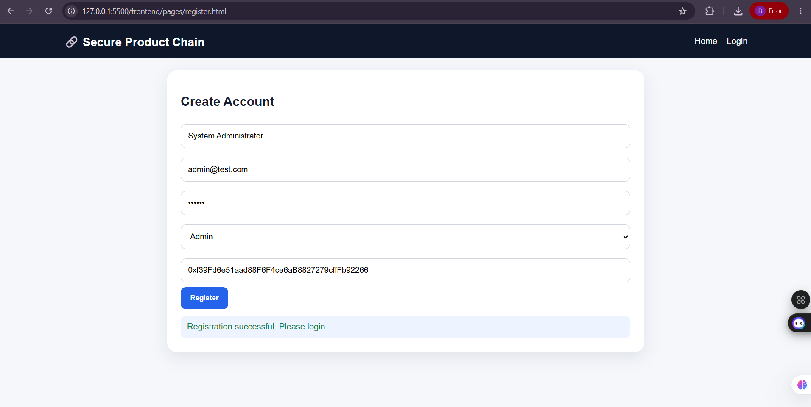

### Admin Login

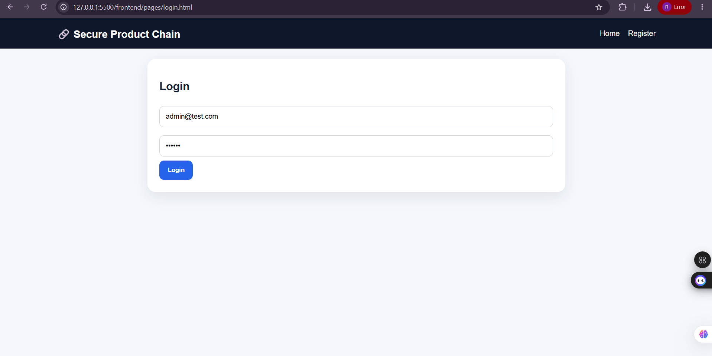

### Admin Dashboard

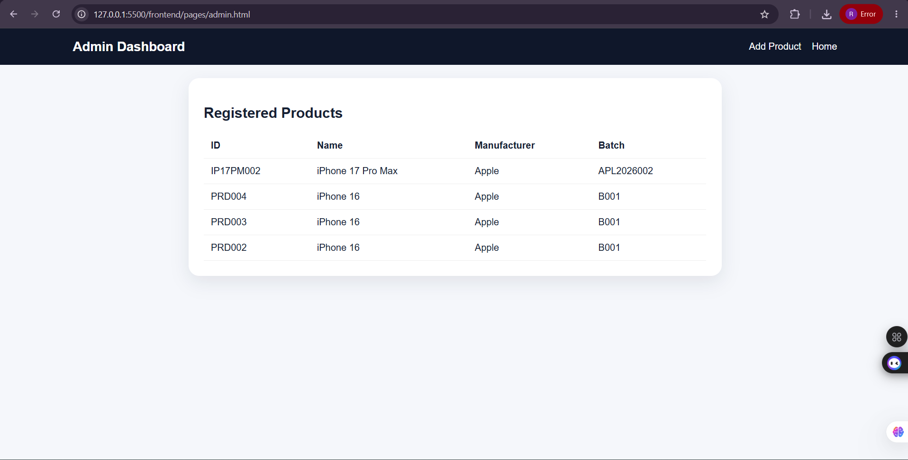

---

## ⚙️ Technical Setup

### MetaMask Connected

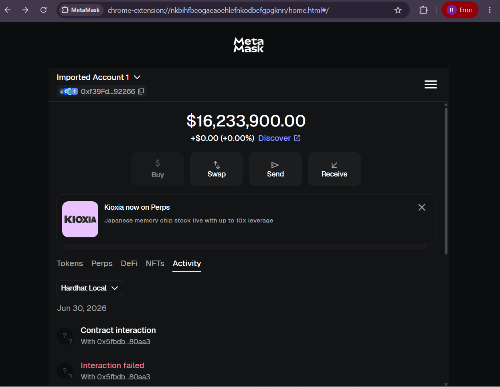

### Hardhat Local Network

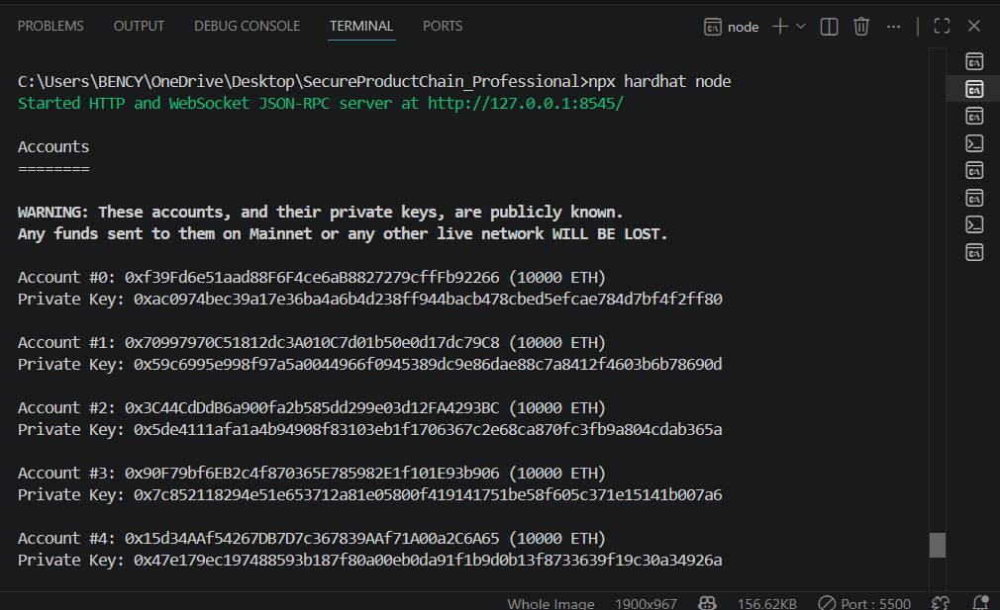

### MongoDB Connected

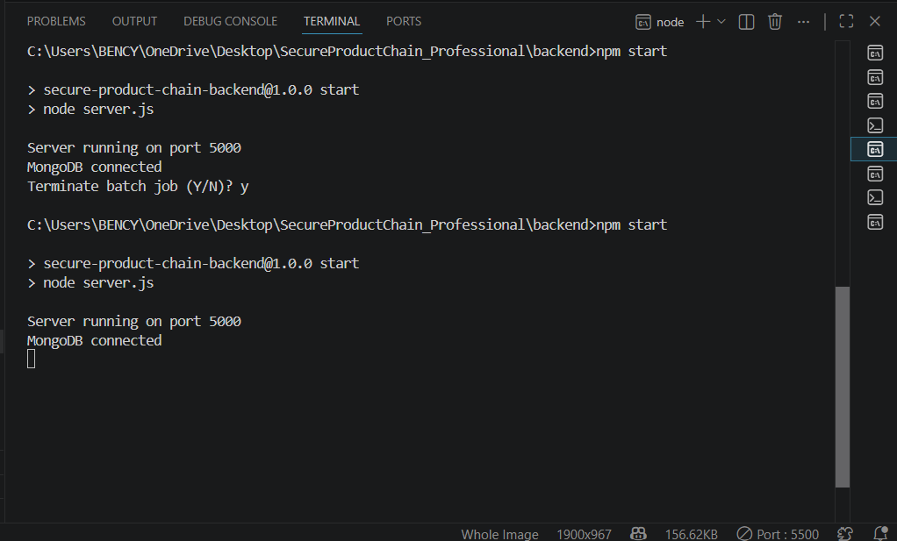
---

## 🔮 Future Enhancements

- Deploy to Ethereum Sepolia Testnet
- Mobile QR Scanner
- Admin Approval Dashboard
- Product History Tracking
- Cloud Deployment
- IPFS Integration

---

## 👨‍💻 Author

**Bency Hanita Angelica K**

Computer Science Engineering Student

Blockchain | Web Development | Cybersecurity Enthusiast

---

## ⭐ If you like this project

Give this repository a ⭐ on GitHub.
